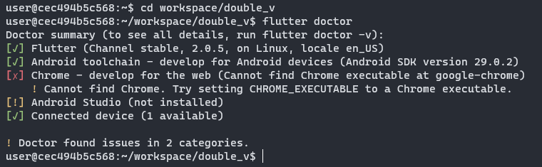

# Double V Partners

## Prueba técnica

Crea un proyecto mobile en flutter que tenga un formulario para crear un usuario con Nombre, Apellido, fecha de nacimiento y agregar una dirección física a tu cuenta (puedes tener muchas direcciones por usuario). El flujo deberá tener 3 pantallas, al menos. Te recomendamos seguir buenas prácticas como control de errores, estados y todo lo que haga que tu código sea elegante. Debemos poder pintar los datos del usuario en cualquier momento de la aplicación.

## Guía para correr la aplicación en local

### Requisitos
- Docker instalado
- Dispositivo Android con la opción 'Wireless debugging'

### Pasos

#### Paso 1
Abrir una ventana de comandos y clonar este repositorio
```
git clone https://github.com/Viiic98/prueba-flutter-Double-V-Partners.git
```

#### Paso 2
Posicionarnos en el root del repositorio, justamente donde se encuentra el 'Dockerfile'

#### Paso 3
Construir la imagen con Docker, para ello debemos ejecutar el siguiente comando:
```
docker build -t double_v .
```

Una vez finalizado podremos ejecutar el siguiente comando:
```
docker images
```
Para ver las imágenes que tenemos y entre ellas veremos la imagen que acabamos de crear

#### Paso 4
Una vez tengamos la imagen creada procederemos a correr la imagen, para ello ejecutamos el siguiente comando:
```
docker run -it IMAGE_ID
```

#### Paso 5
Dentro del contenedor debemos realizar un Android Debug Bridge(adb) que nos permitirá conectar un dispositivo físico al contenedor para posteriormente usarlo para correr nuestra aplicación.
El dispositivo debe estar conectado en la misma red.
Para ello primero nos dirigiremos a Settings > System > Advanced > Developer options > Wireless debugging
Habilitamos el Wireless debugging y nos aparecerá lo siguiente

Presionamos 'Allow' y luego vamos a presionar 'Pair device with pairing code' y nos saldrá lo siguiente


Una vez con esto nos dirigimos a la ventana de comandos y en el contenedor ejecutaremos el siguiente comando:
```
adb pair IP_ADDRESS:PORT
```
Nos pedirá el pair code y lo ingresamos
Si todo va bien saldrá algo como esto:

Procedemos a realizar la conexión adb con el siguiente comando:
```
adb connect IP_ADDRESS:PORT
```

Una vez realizado podremos verificar que nuestro dispositivo esté conectado de la siguiente forma:
```
adb devices
```

#### Paso 6
Ahora es momento de correr la aplicación
Nos dirigimos a la carpeta de la aplicación y corremos el siguiente comando para verificar que flutter reconozca nuestro dispositivo:
```
cd workspace/double_v
flutter doctor
```

Finalmente nos debe aparecer lo siguiente lo cual indica que todo está bien y podremos correr la aplicación.
Para correr la aplicación usamos:
```
flutter run
```
Después de que ha cargado y finalmente se encuentra corriendo nos aparecerá esto en la consola y si miramos nuestro dispositivo se nos habrá abierto la aplicación


### Guía de la aplicación

#### Home
Aquí encontraremos 3 botones que nos permitirán navegar en la aplicación
'Registrar', 'Buscar Usuario', 'Lista de Usuarios'


#### Registrar
Al presionar registrar nos abrirá el siguiente formulario que nos permitirá registrar un usuario.
Se añadió el campo 'Email' como campo único para poder realizar otras funcionalidades en la aplicación.


#### Buscar usuario
Aquí podremos ingresar el 'Email' de un usuario para modificar sus datos o ver los datos de este.


#### Lista de usuarios
Aquí veremos una lista con todos los usuarios que han sido registrados en la aplicación identificados por su correo.
Al lado de cada usuario veremos 3 botones.
El primero nos permitirá modificar los datos del usuario seleccionado
El segundo nos permitirá consultar los datos del usuario
El tercero nos permitirá eliminar al usuario


#### Consultar usuario
Aquí se listarán los datos del usuario.

Esta vista contiene un pop up que permite modificar o eliminar al usuario.


#### Modificar usuario
Aquí se listarán los datos del usuario permitiendo modificar los datos de este.
**Nota: El único dato que no es modificable es el Email**


#### Barra de navegación
Se incluyó una barra de navegación en algunas de las vistas para facilitar la navegación en la aplicación.


## Authors
Victor Arteaga - [LinkedIn](https://www.linkedin.com/in/viiic98)
